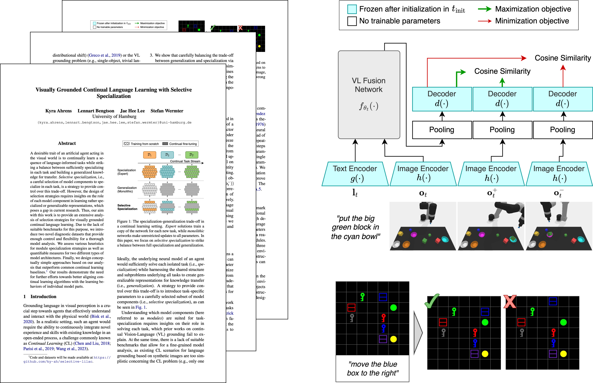

# Visually Grounded Continual Language Learning with Selective Specialization

## This is an extension of the official code repository for the [EMNLP 2023](https://2023.emnlp.org) Findings paper towards pretrained CLIP models as VLMs:

Kyra Ahrens, Lennart Bengtson, Jae Hee Lee, and Stefan Wermter (2023). "Visually Grounded Continual Language Learning with Selective Specialization." 

[Paper](https://arxiv.org/abs/2310.15571) • [LILAC-2D Download](https://www2.informatik.uni-hamburg.de/wtm/datasets2/lilac-2d.zip) • [LILAC-3D Download](https://www2.informatik.uni-hamburg.de/wtm/datasets2/lilac-3d.zip)

## Overview




## Installation

To execute the following commands sequentially:

```bash
git clone https://github.com/ky-ah/SMS.git
cd SMS
pip install -r requirements.txt
```

The dataset will be automatically downloaded to the data directory as specified in `conf/config.yaml`.

## Quickstart

Here are two exemplary commands with different model architectures, datasets, and specialization strategies. **For more configurations, check `config.yaml` file.**

```bash
# CLIP with ResNet-50 and FiLM fusion encoder (CLIP-RN/FiLM):
python train.py arch=FiLM_ResNet dataset=lilac-2d strategy=conv1-conv2-fourth-layer
```
```bash
# CLIP with ViT-B/16 and Transformer fusion encoder (CLIP-ViT/TE):
python train.py arch=Transformer_ViT dataset=lilac-3d strategy=ffn1-all-layers
```

## Additional info
- More strategies for specialization of modules can be found (and added!) in `utils/specialization.py`.
- To use a GPU, please specify the torch device / GPU ID, e.g. `device=gpu:0`, otherwise `device=cpu` for CPU computing. 
- Executing the code as described above automatically downloads, extracts, and loads the LILAC-2D/LILAC-3D datasets. If manual download is desired, the datasets can be accessed by clicking on one of the download URLs provided at the top of this page. 

## Cite our work

If you find our work on continual learning of visually grounded language useful, please cite our work:
```bash
@inproceedings{ahrens-etal-2023-selective-lilac,
    title = "Visually Grounded Continual Language Learning with Selective Specialization",
    author = "Ahrens, Kyra  and
      Bengtson, Lennart  and
      Lee, Jae  and
      Wermter, Stefan",
    editor = "Bouamor, Houda  and
      Pino, Juan  and
      Bali, Kalika",
    booktitle = "Findings of the Association for Computational Linguistics: EMNLP 2023",
    month = dec,
    year = "2023",
    address = "Singapore",
    publisher = "Association for Computational Linguistics",
    url = "https://aclanthology.org/2023.findings-emnlp.469",
    pages = "7037--7054"
}
```